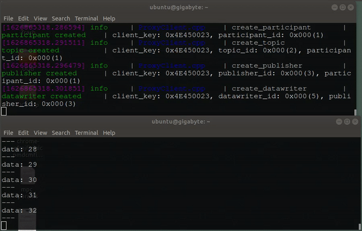

# micro_ros_platformio

This is an experimental [micro-ROS](https://github.com/micro-ROS) app to use [PlatformIO](https://platformio.org/) as an alternative to Arduino IDE in developing [micro_ros_arduino](https://github.com/micro-ROS/micro_ros_arduino) based firmware on Teensy series boards. Here are a few motivations why:

- Allow headless development since you don't need the Arduino IDE to program your firmware with PlatformIO.

- Less setup required. PlatformIO automatically downloads [micro_ros_arduino](https://github.com/micro-ROS/micro_ros_arduino) as a dependency, the first time you compile your code.

- Provide a development template for PlatformIO users.

# Installation

## 1. Installing ROS2 and micro-ROS in the host computer

Follow these [instructions](https://micro.ros.org/docs/tutorials/core/teensy_with_arduino/) on micro-ROS' wiki on how to use Teensy with Arduino - *Installing ROS 2 and micro-ROS in the host compute* .

## 2. Install PlatformIO

You can check out the installation guide how to Install PlatformIO [here](https://docs.platformio.org/en/latest//core/installation.html).

## 3. UDEV Rule
Download the udev rules from Teensy's website:

    wget https://www.pjrc.com/teensy/00-teensy.rules

and copy the file to /etc/udev/rules.d :

    sudo cp 00-teensy.rules /etc/udev/rules.d/

## 4. Configure your Teensy Board
The default board used in this demo is Teensy 3.6 but you can uncomment the Teensy board you're using

    [env:teensy36]
    board = teensy36

    ; [env:teensy35]
    ; board = teensy35

    ; [env:teensy36]
    ; board = teensy36

## 5. Upload the firmware

Upload the firmware by running:

    cd micro_ros_platformio
    pio run --target upload

# Running the demo

## 1. Publisher
Run the micro-ROS agent to relay the data streaming from your microcontroller to your host computer through the Serial port:

    ros2 run micro_ros_agent micro_ros_agent serial --dev /dev/ttyACM0

## 2. Subscriber
Now you can use ros2 topic tool to display the messages being published by the agent:

    ros2 topic echo /micro_ros_arduino_node_publisher

## Expected results

## Troubleshooting Guide

1. Nothing's displayed on ros2 topic echo.
- Try unplugging your microcontroller after uploading the firmware and run the agent again.